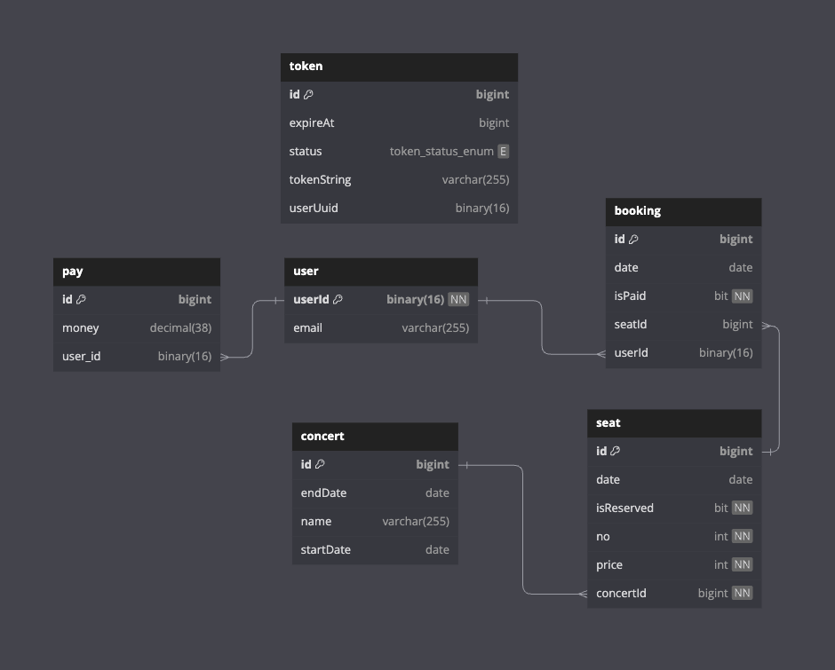

## My Backend

### Api Docs

* [Api 명세서 링크](http://my-lb-120959135.ap-northeast-2.elb.amazonaws.com:8080/docs/index.html)

### ERD

* [ERD 링크](https://dbdiagram.io/d/my-backend-657d7dd856d8064ca0245e8c)
* 

### DB

```shell
docker run -d -p 3306:3306 -e MYSQL_ROOT_PASSWORD=1234 --name my-backend-db mysql:5.7.42
```

### back-end docker

```shell
docker build -t my-backend:latest .
docker run -e "spring.profiles.active=dev" -p 8080:8080 my-backend:latest
```

### git submodule

```shell
git submodule foreach git pull
```

### Rest docs

```shell
java -jar ./build/libs/my-backend-0.0.1-SNAPSHOT.jar
```

### Format
```shell
./gradlew format
```

### ref

- [spring-restdocs](https://docs.spring.io/spring-restdocs/docs/current/reference/htmlsingle/#introduction)
- [jwt.io](https://jwt.io/)
- [howto](https://docs.spring.io/spring-boot/docs/current/reference/html/howto.html)
